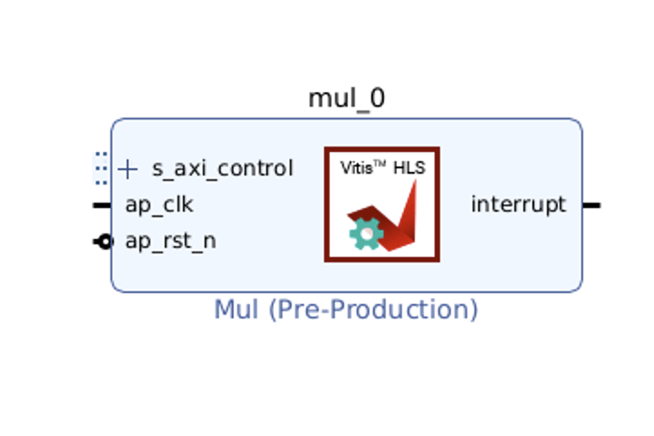

Lab: Pynq Memory Mapped IO (s_axilite)
=====================================

This lab will guide you through the basics of using Pynq to develop an application on the Zynq / Ultrascale SoC. The application performs a simple hardware accelerated function on the programmable logic. We first create the IP core that performs the function :math:`f(x) = 2x` using high level synthesis. We synthesize it to the programmable logic using the Vivado tools.  Using the PYNQ infrastructure, we talk to the IP core from ARM processor using memory mapped I/O. We develop a Pynq notebook that sends data to the IP core, executes the core, and receives the computed results. 

To simplify the steps and increase reproducibility, we will replace most GUI operations with command line scripts (so you can simple run one command instead of clicking 100 buttons).

You do have the option to use the GUI of Vitis Unified IDE. We'll cover it `here <https://pp4fpgas.readthedocs.io/en/latest/vitis_unified.html>`_.

If you're curious about GUI-based classic Vitis HLS, check `here <https://pp4fpgas.readthedocs.io/en/latest/PYNQ-example-legacy.html>`_ for a the legacy version of this lab using GUI with Xilinx Vivado and Vitis HLS 2022.2.

0) Vivado Design suite installation
------------------------------------

Check `here <https://kastner.ucsd.edu/ryan/vivado-installation/>`_ for installation and UCSD license server guide, though you probably would not need the license server for the projects in this course.

We provide a docker for you in case your machine is not supported by AMD FPGA tools. Check `here <https://github.com/KastnerRG/vitis_docker/>`_ for the docker image and instructions.

If you wish to use the download the software yourself, please refer to the official AMD guide `here <https://www.xilinx.com/support/download/index.html/content/xilinx/en/downloadNav/vivado-design-tools/2024-2.html>`_. For export control compliance, you will need to create an account if you do not already have one.

Both Vivado and Vitis are needed for the class. You should select the Vitis as the product to install, which includes Vivado design suite. AMD provides an installtion guide `here <https://docs.amd.com/r/2024.2-English/ug973-vivado-release-notes-install-license/Download-and-Installation>`_.

UCSD students
~~~~~~~~~~~~~~
Campus provides UCSD Linux cloud to run AMD tools. Log in using your AD username and password `here <https://linuxcloud.ucsd.edu/>`_. You can select a machine under **ieng6 Linux Mint Remote Desktops**. One server corresponds to a physical machine.

To solve some current package issues on ieng6 machines, run these commands (you only need to run this once, no need to run this every time you log in):

   ``mkdir -p ~/xlnx_compat_fix``
   
   ``ln -s /usr/lib/x86_64-linux-gnu/libtinfo.so.6 ~/xlnx_compat_fix/libtinfo.so.5``

Add the following lines to your **~/.bashrc** file, these include loading AMD tools, a quick path to resolve some package issues, and beautify your terminal.

   ``force_color_prompt=yes``

   ``PS1='\e[33;1m\u@\h: \e[31m\W\e[0m\$ '``

   ``module load xilinx-vitis``

   ``export LD_LIBRARY_PATH=~/xlnx_compat_fix/:$LD_LIBRARY_PATH``

Remember to ``source ~/.bashrc`` for the changes to take effect.

1) Vitis HLS: C/C++ to RTL
---------------------------

Check the HLS source code `here <https://github.com/KastnerRG/Read_the_docs/tree/master/project_files/lab1>`_. This contains:

  - mul.cpp - Implements top-level function

  - mul.h - header file

  - mul_test.cpp - test bench

  - __hls_config__.ini - Record important HLS project settings including target clock period and board part. Also specify the name of the top function.

  - Makefile - Makefile to run the HLS tool from the command line.

Project 1 already showed you how to run a HLS project. This lab will focus on its integration with other components to form a proper FPGA system.

The circuits generated by your HLS design will not work on its own. Data has to be transferred in and out of the HLS block. Therefore, the interfaces of your block (i.e., the top level C++ function in `mul.cpp` must follow some protocol. In this lab, we use a very simple on-chip communication protocol AXI-Lite. Note lines 19-21 in `mul.cpp`:

.. code-block:: c++

	#pragma HLS INTERFACE mode=s_axilite port=return
	#pragma HLS INTERFACE mode=s_axilite port=in
	#pragma HLS INTERFACE mode=s_axilite port=out

The code is already functional and synthesizable. You should be able to run C simulation and synthesis just like in project 1. Simply do:

   
   ``make report``

Our next step is to export our design as an IP core, which can be imported into Vivado later. You can run this command:

   ``make ip``

The IP core is a .zip file located at:

   ``mul.comp/hls/impl/ip/xilinx_com_hls_mul_1_0.zip``

At this point, you can exit and close Vitis HLS.

2) Vivado: RTL to bitstream
---------------------------

In this section, you will import your IP core to Vivado, build the system, and generate the bitstream.

2.1) Create a new project
~~~~~~~~~~~~~~~~~~~~~~~~~

Open Vivado and create a new project. If you are using Linux, it is recommended to launch Vivado from the same directory of the source files.

.. image:: https://github.com/KastnerRG/Read_the_docs/raw/master/docs/image/lab0_screenshot/10.png

Select **RTL Project** and check **Do not specify sources at this time**

.. image:: https://github.com/KastnerRG/Read_the_docs/raw/master/docs/image/lab0_screenshot/11.png

Set default part to **xc7z020clg400-1**

.. image:: https://github.com/KastnerRG/Read_the_docs/raw/master/docs/image/lab0_screenshot/12.png

Under **IP Integrator**, click on **Create Block Design**

.. image:: https://github.com/KastnerRG/Read_the_docs/raw/master/docs/image/lab0_screenshot/13.png

2.2) Import your design
~~~~~~~~~~~~~~~~~~~~~~~

Under **Project Manager**, click on **IP Catalog**. Right click inside the newly open 'IP Catalog' tab and select **Add Repository**. In the open window navigate to your Vitis HLS project folder and select **<path_to_vivado_hls_folder>/hls/impl/ip/**

.. image:: https://github.com/KastnerRG/Read_the_docs/raw/master/docs/image/lab0_screenshot/14.png

You can see **Mul** under **IP Catalog**.

.. image:: https://github.com/KastnerRG/Read_the_docs/raw/master/docs/image/lab0_screenshot/16.png

Click **Open block design**, then click **+**, add **Mul_test** IP block into our block design.

.. image:: https://github.com/KastnerRG/Read_the_docs/raw/master/docs/image/lab0_screenshot/17.png

The IP block will appear in the block diagram:

Note that there are no more wires called "in" or "out". Instead, there is a bus port named ``s_axi_control`` and `in` and `out` become addressable registers, as we set the interface through HLS pragmas. This AXI-Lite bus include all the hand-shaking signals and the actual data channels. You can expand the bus to see all the ports. 

2.3) Add connections
~~~~~~~~~~~~~~~~~~~~

In the same window, search for "zynq" and add **ZYNQ7 Processing System** to your block design.

.. image:: https://github.com/KastnerRG/Read_the_docs/raw/master/docs/image/lab0_screenshot/18.png

Your diagram should look like the following:

.. image:: https://github.com/KastnerRG/Read_the_docs/raw/master/docs/image/lab0_screenshot/19.png

On top of **Diagram** window, first click and complete **Run Block Automation** and then **Run Connection Automation** with default settings. Your diagram should change and show connections and a couple of extra IPs:

.. image:: https://github.com/KastnerRG/Read_the_docs/raw/master/docs/image/lab0_screenshot/20.png

.. image:: https://github.com/KastnerRG/Read_the_docs/raw/master/docs/image/lab0_screenshot/21.png

.. image:: https://github.com/KastnerRG/Read_the_docs/raw/master/docs/image/lab0_screenshot/22.png

2.4) Generate bitstream
~~~~~~~~~~~~~~~~~~~~~~~

In **Sources**, right click on **design_1** and select **Create HDL Wrapper**

.. image:: https://github.com/KastnerRG/Read_the_docs/raw/master/docs/image/lab0_screenshot/23.png

.. image:: https://github.com/KastnerRG/Read_the_docs/raw/master/docs/image/lab0_screenshot/24.png

Under **Program and Debug**, click on **Generate Bitstream** and follow instructions to complete synthesis, implementation and bitstream generation.

2.5) Bitstream, .hwh, and addresses
~~~~~~~~~~~~~~~~~~~~~~~~~~~~~~~~~~~

Before closing Vivado, we need to note our IP and its ports addresses. 

Under **Sources**, open **mul_test_control_s_axi.v** (the exact name may vary across different versions of Vivado), scroll down and note addresses for in and out ports. We need these addresses for our host program.

In the example below for the streamMul, the addresses to pay attention to are 0x00 (control bus ap_ctrl), 0x10 (output), and 0x20 (input). These are the addresses you will need to use to write data to the fabric from the ARM core, start the fabric to run your design and generate your outputs, and then read your outputs from the fabric into the ARM core on the Pynq board.

.. image:: https://github.com/KastnerRG/Read_the_docs/raw/master/docs/image/lab0_screenshot/25.png

The addresses above are within our IP. However, for the CPU to interact with our IP, it will also need the base address of our IP. You can find it under **Address Editor**.

.. image:: https://github.com/KastnerRG/Read_the_docs/raw/master/docs/image/lab0_screenshot/26.png

The next step will be to run the design on an FPGA board. The software need 2 neseccary files;

  - Bitstream file (.bit) - to be flashed to the FPGA

  - Hardware handoff file (.hwh) - to be read by the Pynq software to understand the architecture hardware design.

3) PYNQ board and Host program
------------------------------

Download an appropriate image for your board from `here <http://www.pynq.io/boards.html>`_ and write it to your micro SD Card (`PYNQ-Z2 setup instructions <https://pynq.readthedocs.io/en/latest/getting_started/pynq_z2_setup.html>`_). It is recommended to use a dedicated software, e.g. Win32 Disk Imager to burn the .img file to the SD card instead of a simple copy-paste operation, if you find the board cannot booted properly. If you set the jumpers correctly, the boot process should not take more than **a few minutes**.

Use the ethernet cable to connect the board to your machine, and set the static address as stated in the `PYNQ-Z2 tutorial <https://pynq.readthedocs.io/en/latest/getting_started/pynq_z2_setup.html>`_. **Optional**: Connect the JTAG port on the board with your machine using MicroUSB line, and use serial communication software (like PuTTY or Serial Port Unility) to access the command-line-tools (The picture below is for demo only, you don't need to run those commands). This is especially useful for fixing Linux-related issues of the board.

.. image:: https://github.com/KastnerRG/Read_the_docs/raw/master/docs/image/lab0_screenshot/ubuntu_config.png

You can access jupyter notebook through the ipv4 address via a web browser. Create a new folder and notebook. Upload **design_1_wrapper.bit** from **vivado_project_path/project_name.runs/impl1** and copy **design_1.hwh** from **vivado_project_path/project_name.gen/sources_1/bd/design_1/hw_handoff** to the folder you just created in Jupyter.

Make sure the .bit file and the .hwh file have the same name. In this case, we name them "design_1_wrapper.bit" and "design_1_wrapper.hwh".

In the notebook, run the following code to test your IP

.. code-block:: python

	from pynq import Overlay
	from pynq import MMIO

	ol = Overlay("./design_1_wrapper.bit") # designate a bitstream to be flashed to the FPGA
	ol.download() # flash the FPGA

	mul_ip = MMIO(0x40000000, 0x10000) # (IP_BASE_ADDRESS, ADDRESS_RANGE), told to us in Vivado
	inp = 5 # number we want to double

	mul_ip.write(0x20, inp) # write input value to input address in fabric
	print("input:", mul_ip.read(0x20)) # confirm that our value was written correctly to the fabric
	mul_ip.write(0x00, 1) # set ap_start to 1 which initiates the process we wrote to the fabric
	print("output:", mul_ip.read(0x10)) # read corresponding output value from the output address of the fabric 

4) Kria board
-------------
If you are working with a Kria board, there are several necessary changes you have to make. Instead of selecting **xc7z020clg400-1** as the part or **pynq-z2** as the board, you will have to select **xck26-sfvc784-2LV-c** as the part or select **Kria KV260 Vision AI Starter Kit SOM** as the board. This is necessary both for **Vitis HLS** and **Vivado**. As the EDA tools must know what hardware they are targeting. The hardware must also match the board we are eventually using. If the bitstream and hwh generated by Vivado (in which the board is specified) is used in a different kind of board, the pynq software system will have trouble recognizing it.

.. image:: https://github.com/KastnerRG/Read_the_docs/raw/master/docs/image/Kria_board.png

In Vivado, the steps for adding IPs are the same, but Kria has a different PS (processing system, the ARM core on board) with pynq-z2. In "Add IP" window, select **Zynq Ultrascale+ MPSoC** instead of **ZYNQ7 Processing System**.

.. image:: https://github.com/KastnerRG/Read_the_docs/raw/master/docs/image/mpsoc.png

Then follow the green designer assistance and let the tool do "block automation" and "connection automation". You probably have to run connection automation twice. Your block diagram should look like this (from project 2: CORDIC):

.. image:: https://github.com/KastnerRG/Read_the_docs/raw/master/docs/image/kria_block.png

Note that there should be no ports named x, y, r, theta, as they all become some address in the s_axi_control bus.

You should also be able to find the module named control_s_axi_U under the file tree, and locate the address as the lab tutorial.

Setting up a Kria board for pynq is different, and a bit more complex. Please refer to the following resources: `Pynq-supporting boards (find KV260) <https://www.pynq.io/boards.html>`_ , `Basic steps <https://discuss.pynq.io/t/kria-pynq-v3-0-release-now-with-kr260-support/4865>`_, `Kria pynq repo <https://github.com/Xilinx/Kria-PYNQ>`_ 

Basics of FPGA & PS-PL interaction
~~~~~~~~~~~~~~~~~~~~~~~~~~~~~~~~~~
At architecture level, an FPGA is divided into 2 domains: PS and PL.

PS, or processing system, is an Arm core, in charge of controlling everything, managing memory, creating clock, etc. Consider this as the CPU. The big IP block in your diagram starting with "Zynq" is the PS.

PL, or programming logic, is basically everything else. The most important one is the IP you just designed in Vitis HLS, an efficient hardware dedicated for some task, or usually referred to as the "accelerator". Some are auxiliary modules that are typically auto-managed by tools. 

The accelerator cannot access data directly. The PS has to move the data between the memory and your accelerator. Thus the accelerator and the PS must be connected by some on-chip bus protocol. The easiest protocol is axi_lite. If you wish to put an accelerator on an FPGA, you must specify its port type during the design phase in Vitis HLS. Check Step 1 for the commands. 
