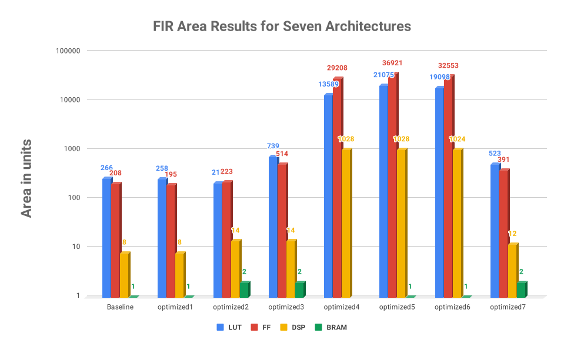
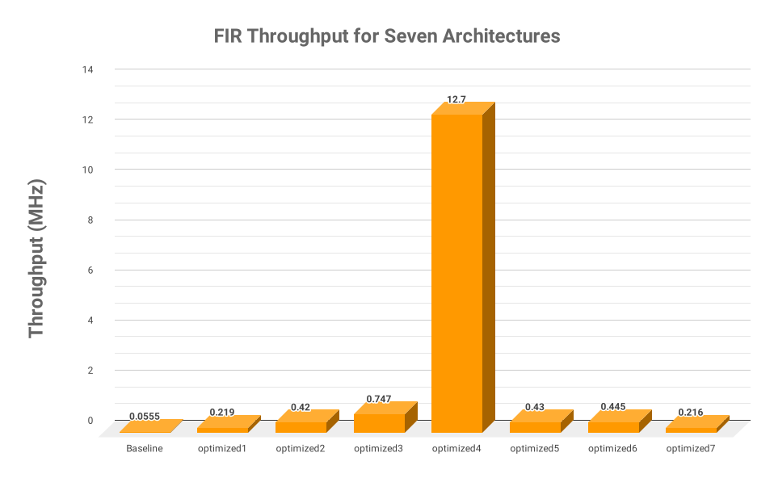

Project: FIR Filter Design
============================

1) Introduction
---------------

The goal of this project is to learn how the basics of an HLS tool. The learning outcomes are to gain a basic understanding of how the Vivado HLS tool works, to get exposed to the different types of HLS optimizations, to perform a guided design space exploration to obtain architectures with different tradeoffs in performance and resource usage, to generate a high quality FIR architecture, and to demonstrate the integration of that FIR on the Zynq FPGA using the Pynq infrastructure.

This project is designed to be paired with Chapter 2 from `Parallel Programming for FPGAs book <http://kastner.ucsd.edu/hlsbook/>`_. The book directly covers many aspects of the optimizations in this project. We strongly encourage the reader to use this as a reference.

The project is divided into three parts:

* Design an 11 tap FIR filter
* Design and optimize a 128 tap FIR filter
* Prototype an FIR filter architectures on a Zynq FPGA

You should start this assignment by understanding the 11 tap FIR filter, and implementing a functionally correct design. Next, you modify the code and experiment different optimizations which are specified in the questions. Note that the 128 FIR filter is more complex and may have different trade-offs, and in the final report you need to answer the questions with regard to the 128 tap filter. Your answers should demonstrate your understanding of different optimization and their effects on throughput, latency and area. Finally, you will take one of your FIR filter designs, program that on a Zynq FPGA, and demonstrate its functionality with the Pynq infrastructure.

2) Preparation
--------------

Before you start, we strongly suggest that you go through these high-level synthesis tutorials: Lab 1, Lab 2 and Lab 3 in this document: *ug871-vivado-high-level-synthesis-tutorial.pdf*. You can find this document and lab files at `here <https://github.com/KastnerRG/pp4fpgas/blob/master/Vivado_HLS_Tutorial_2019.zip?raw=true>`_

3) Materials
------------

You can download the project files here:

* `project1.zip <https://github.com/KastnerRG/pp4fpgas/blob/master/labs/project1.zip?raw=true>`_

* fir11 folder: 11 tap fir filter

  - fir.cpp - Implements top level function

  - fir.h - header file

  - fir_test.cpp - test bench

  - input.dat - input chirp signal

  - out.gold.dat - “Golden” output. When the testbench (from fir_test.cpp) is run through the file fir.cpp it should generate this result. If it does not, you did something wrong.

* fir128 folder: 128 tap fir filter

  - fir.cpp - Implements top level function

  - fir.h - header file

  - fir_test.cpp - test bench

  - input.dat - input chirp signal

  - out.gold.dat - “Golden” output. When the testbench (from fir_test.cpp) is run through the file fir.cpp it should generate this result. If it does not, you did something wrong.

* Tutorial folder:

  - ug871-vivado-high-level-synthesis-tutorial.pdf - Various tutorials for Vivado HLS

* demo folder: Demo folder for 11 tap filter

  - input.dat - input chirp signal

* Target Board: xc7z020clg400-1

* Software: Vivado 2019.1

* Time Period: 10 ns or 100MHz

4) Project Goal
---------------

The first goal of this project is to generate a functionally correct HLS design for an 11 tap FIR filter. Also you should start to gain an understanding of different HLS optimizations. For FIR128, you should modify the code to generate several optimized designs. Your goal is to create designs that provide tradeoffs between resource usage and execution time. This will require you to rewrite the code and/or insert pragmas. More specifically, you must do the following:

* Design an 11 tap FIR filter with HLS. In the rest of this document, we use the term FIR11 to refer this task.

* Design a 128 tap FIR filter with HLS and optimize it. We call this subtask FIR128.

5) FIR11
--------

The first step for the project is to get a functionally correct design working for an 11 tap FIR filter. For this, you will need to use the Vivado HLS tool, and finish the function body of “void fir()” in the file fir.cpp to implement the filter. You can test the correctness of your code by using the provided testbench. This code does not need to be highly optimized; you will work on creating optimized code later. It just needs to work correctly. **Use the provided script.tcl to create your project**.

6) FIR128 Instructions
----------------------

You must complete the following tasks:

1. First, implement a functionally correct, but not optimized, 128 tap FIR filter. This is your baseline implementation. Use the provided script.tcl to create your project.

2. Then generate one or multiple designs that will help you answer the questions in your report. In your answers, you should reference the design that you generated for your experiment. You can reference the same design from multiple answers. Your resulting code must always be functionally correct, i.e., match the golden output. In your report you need to clearly answer the effect of following optimizations on your design. You can test other optimizations as you wish, but you do not need to include in the report.

3. Finally, generate your best architecture by combining any number of optimizations that you wish.

4. Your report should only include the answers to the following questions.

Questions:

For each of the following questions you need to reference a design or multiple designs. The source code in your design should have all the necessary pragmas.

* **Question 1 - Variable Bitwidths:** It is possible to specify a very precise data type for each variable in your design. The number of different data types is extensive: floating point, integer, fixed point, all with varying bitwidths and options. The data type provides a tradeoff between accuracy, resource usage, and performance. 

  Change the bitwidth of the variables inside the function. How does the bitwidth affect the performance? How does it affect the resource usage? What is the minimum data size that you can use without losing accuracy (i.e., your results still match the golden output)?

* **Question 2 - Pipelining:** Pipelining increases the throughput typically at the cost of additional resources. The initiation interval (II) is an important design parameter that changes the performance and resource usage.

  Explicitly set the loop initiation interval (II) starting at 1 and increasing in increments of 1 cycle. How does increasing the II affect the loop latency? What are the trends? At some point setting the II to a larger value does not make sense. What is that value in this example? How would you calculate that value for a general for loop?

* **Question 3 - Removing Conditional Statements:** If/else statements and other conditionals can limit the possible parallelism and often require additional resources. If the code can be rewritten to remove them, it can make the resulting design more efficient.

  Rewrite the code to remove any conditional statements. Compare the designs with and without if/else condition. Is there a difference in performance and/or resource utilization? Does the presence of the conditional branch have any effect when the design is pipelined? If so, how and why?

* **Question 4 - Loop Partitioning:** Dividing the loop into two or more separate loops may allow for each of those loops to be executed in parallel, enable loop level pipelining, or provide other benefits. This may increase the performance and the resource usage.

  Is there an opportunity for loop partitioning in FIR filters? Compare your hardware designs before and after loop partitioning. What is the difference in performance? How do the number of resources change? Why?

* **Question 5 - Memory Partitioning:** The storage of the arrays in memory plays an important role in area and performance. On one hand, you could put an array entirely in one memory (e.g., BRAM). But this limits the number of read and write accesses per cycle. Or you can divide the array into two or more memories to increase the number of ports. Or you could instantiate each of the variables as its own register, which allows simultaneous access to all of the variables at every clock cycle.

  Compare the memory partitioning parameters: block, cyclic, and complete. What is the difference in performance and resource usage (particularly with respect to BRAMs and FFs)? Which one gives the best performance? Why?

* **Question 6 - Best Design:** Combine any number of optimizations to get your best architecture. In what way is it the best? What optimizations did you use to obtain this result? It is possible to create a design that outputs a result every cycle, i.e., get one sample per cycle, so a throughput of 100 MHz (assuming a 10 ns clock). A design with high throughput will likely take a lot of resources. A design that has small resource usage likely will have lower performance, but that could still be the best depending the application goals.

It is possible that some optimizations may not have a big (or any effect). Some optimizations may only work when you use them in combination with others. This is what makes the design space exploration process difficult.

7) PYNQ Demo
---------------

Following are steps to implement your FIR11 HLS design on the PYNQ board. You will provide the input data (chirp signal) from the Notebook, and get the output from the PL on PYNQ. To do that, you must write a *host_fir.ipynb* program.

The specific things you must do in this section are:

* Download an appropriate image for your board from `PYNQ.io <http://www.pynq.io/>`_ and write it to your SDCard (`instructions <https://pynq.readthedocs.io/en/latest/getting_started.html>`_).

* Go through :doc:`Simple IO <PYNQ-example>` example and learn how to write an IP for PYNQ and interact with it.

* Implement your 11-tap FIR design on PYNQ board.

* Write a host program *host_fir.ipynb*. The expected output is as shown below:

.. image:: https://github.com/KastnerRG/pp4fpgas/raw/master/labs/images/demo1.png

8) Report Guidelines
--------------------

FIR11
~~~~~

* Submit your code (only source code for synthesis) and tcl script.

* Submit synthesis reports (.rpt file **and** .xml document files, located in a "/syn/report" folder).

Demo
~~~~

* Submit your code (only host code)

* Submit a screenshot of results

* Submit your bitstream

FIR128
~~~~~~

* For each "interesting" architecture:

  - Submit your code and tcl script

  - Submit synthesis reports (.rpt **and** .xml)

  -"Interesting" is imprecise, but it is often difficult to say definitively that one design is the best. Typically there are different designs that Pareto optimal. Any design that you discuss in answers to your questions should be submitted. Often one performs a lot of design space exploration by changing values, and this can lead to a lot of architectures, many of which are "bad" or "uninteresting". We don't need details on those. A good target is more than 5 and less than 20 "interesting" designs. Your report should only include the answer to the questions. Please clearly indicate where each question is answered in your report.

For each question, explicitly mention which design(s) you used in your answers. You are asked to discuss different performance and resource metrics. Make sure that the method used to calculate the performance and resource metrics is clear. Throughput calculation methods are described below. It is typically best to report performance metrics in terms of seconds (or frequency = 1/seconds) rather than some other interval, e.g., clock cycles.

You are strongly encouraged to use figures to explain an answer. Figure 1 and Figure 2 provide a typical way to compare different architectures. These are not the best figures, and can certainly be made better, but serve as a reference that can relatively easily be generated. You can also consider different figures, e.g., to provide an overview of a particular architecture or help explain how you determined the "best design" (i.e., your process of design space exploration).

Throughput Calculation
~~~~~~~~~~~~~~~~~~~~~~

The throughput is reported in Hz using the formula from Equation 2. Note that you should use the "Estimated Clock Period (ns)" from HLS report instead of the specified clock period. The former is more accurate (though not totally accurate - to do that you must perform complete synthesis to bitstream) than the latter, which is the user-specified target rate clock period. Often the tools can do better than the estimated clock period.

The throughput in Hertz can be calculated as:

.. math::
  Throughput (Hz) = 1/(Clock Period (s) * #Clock Cycles)
  :label:

The throughput in Mhz can be calculated as:

.. math::
  Throughput (Mhz) = 1000/(Clock Period(ns) * #Clock Cycles)
  :label:

You should always present your results using units (Hz, KHz, MHz, etc.) that make “sense”. For example, you should not do 10000 Hz rather 10 KHz. Or not 0.02 MHz rather 20 KHz

Example Figures
~~~~~~~~~~~~~~~

Figure 1 shows an example graph of resource usage for 8 designs. Figure 2 shows the performance of these 8 designs in terms of throughput.

*Figure 1. Area results of different FIR designs. Note that these are only for reference and do not necessarily correspond exactly to results that you can/should obtain.*

*Figure 2. Example throughput results for different FIR designs. Note that these are only for reference and do not necessarily correspond exactly to results that you can/should obtain.*

9) Submission Procedure
-----------------------

You should submit a report as described in the report instructions for project 1.

You must also submit your code (and only your code, not other files). Your code should have everything in it so that we can synthesize it directly. This means that you should use pragmas in your code, and not use the GUI to insert optimization directives. We must be able to only import your fir.cpp/h file and directly synthesize it. You can assume that we have correctly set up the design environment (fir_test.cpp, etc.).

You must follow the file structure below. We use automated scripts to pull your data, so **DOUBLE CHECK** your file/folder names to make sure it corresponds to the instructions.

Your repo must contain a folder named "project1" at the top-level. This folder must be organized as follows:

* **Report.pdf**

* Folder **fir11_baseline**: fir.h | fir.cpp | script.tcl | fir_csynth.rpt | fir_csynth.xml

* Folder **fir128_baseline**: fir.h | fir.cpp | script.tcl | fir_csynth.rpt | fir_csynth.xml

* Folder **fir128_optimized1**: fir.h | fir.cpp | script.tcl | fir_csynth.rpt | fir_csynth.xml

* Folder **fir128_optimized2**: fir.h | fir.cpp | script.tcl | fir_csynth.rpt | fir_csynth.xml

* Folder **fir128_optimized3**: fir.h | fir.cpp | script.tcl | fir_csynth.rpt | fir_csynth.xml

* Folder **fir128_optimized4**: fir.h | fir.cpp | script.tcl | fir_csynth.rpt | fir_csynth.xml

* Folder **fir128_optimized5**: fir.h | fir.cpp | script.tcl | fir_csynth.rpt | fir_csynth.xml

* Folder **fir128_best**: fir.h | fir.cpp | script.tcl | fir_csynth.rpt | fir_csynth.xml

* Folder **demo**: (WES students only) host_fir.ipynb | bitstream | tcl file | results.[jpg|png]

* *fir128_optimizedN* correspond to the architectures that you generated to answer the questions. You can have one or multiple, just make sure the code is readable (i.e., do not put multiple optimizations commented out in the same file).

* *fir128_best* is the folder containing your best architecture.

Submission
~~~~~~~~~~

Place your code on your Bitbucket repository. Put separate assignments in separate folders. Name each folder "projectX" where X is the assignment number. Place your report directly under your project folder.

10) Grading Rubric
------------------

Your grade will be determined by your answers to the questions. Your answers should be well written. Additional points (up to 20) will be subtracted for poor formatting and/or answers that are hard to understand. Examples of issues include any spelling errors, multiple/egregious grammar errors, poor presentation of results, lack of written comparison of the results, etc. A well-written report is informative but not overly verbose. You will be deducted points if you do not follow the instructions on directory naming and file structure.

The report comprises of 80% of your grade. Remaining 20% is for the performance of the best version of your fir128 filter. If your design achieves a throughput of greater than 0.5MHz but less than 1MHz then you will be awarded 10 points. If you achieve 1MHz and higher than you will get complete 20 points. Try to make resource usage as small as possible. The resource usage must be within the resources provided by the Pynq board. Similarly the timing has to be fulfilled, i.e. the clock achieved should be within 10ns (100 MHz).  
