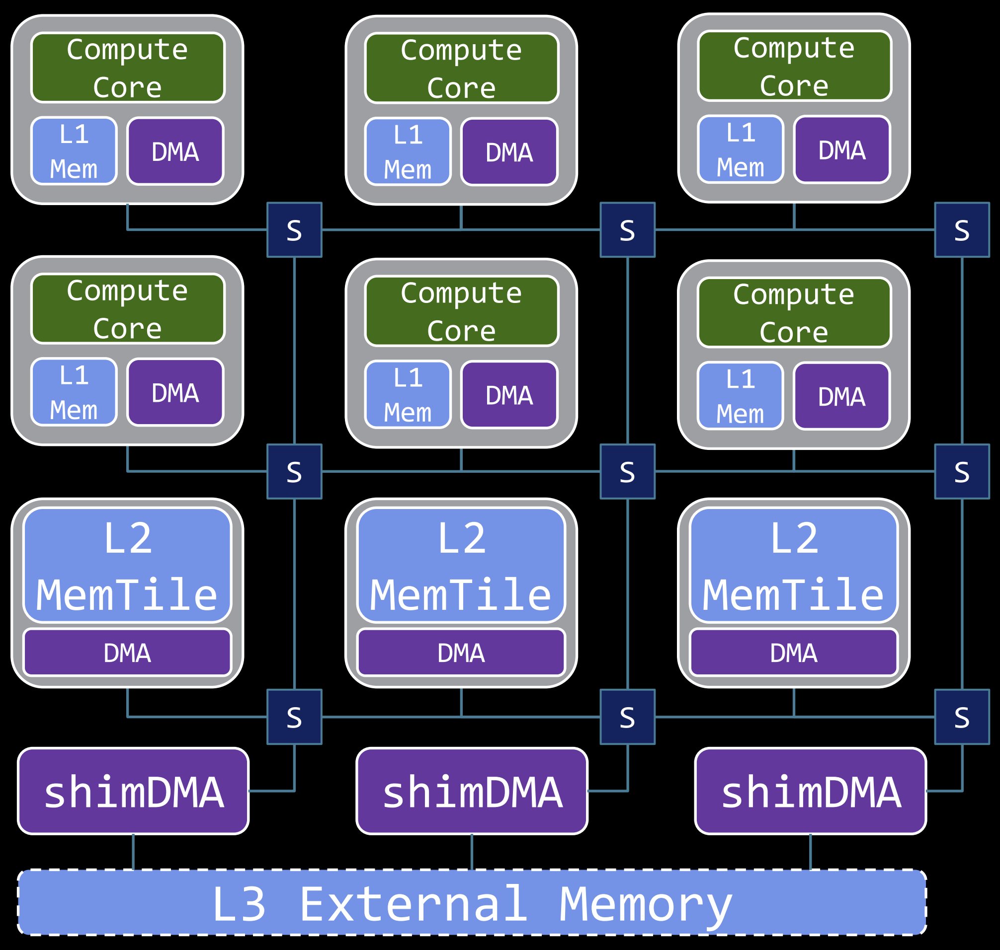
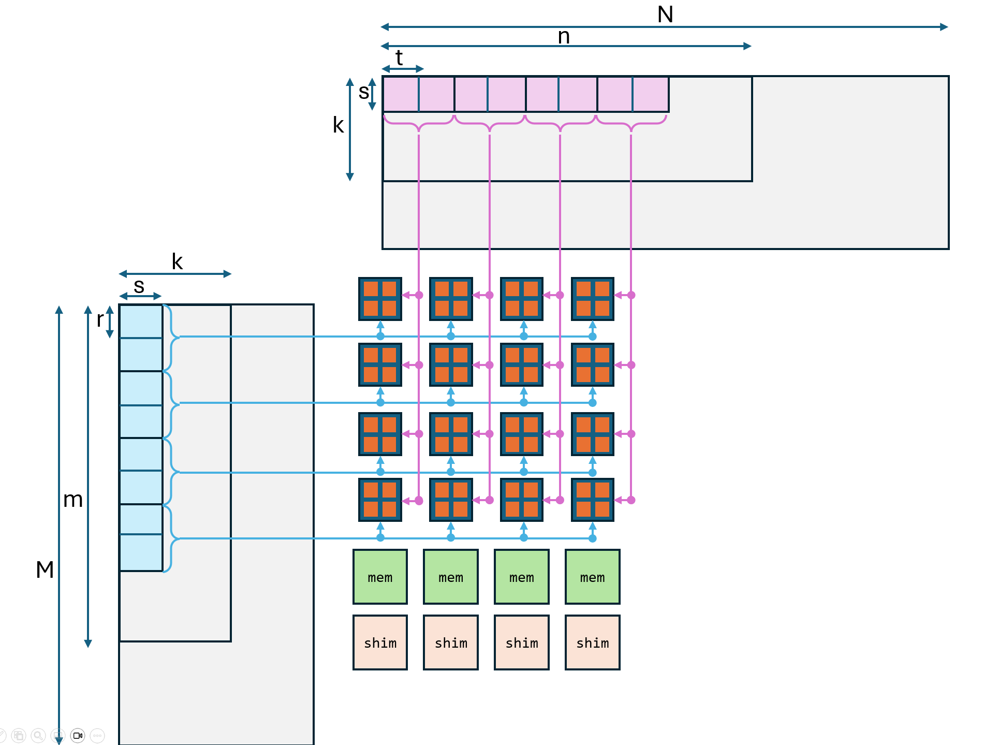
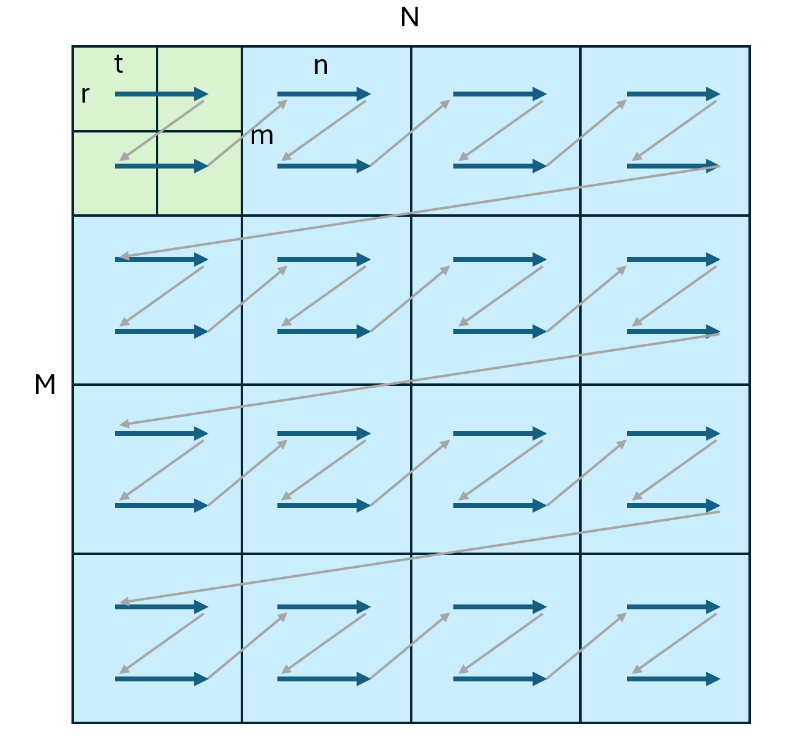
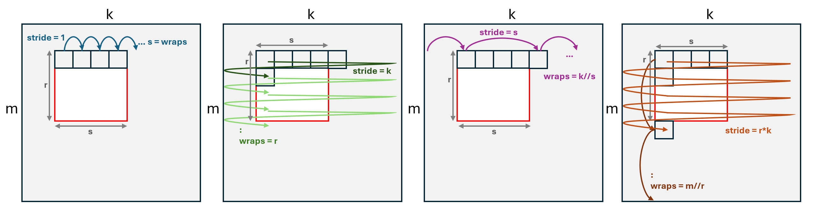
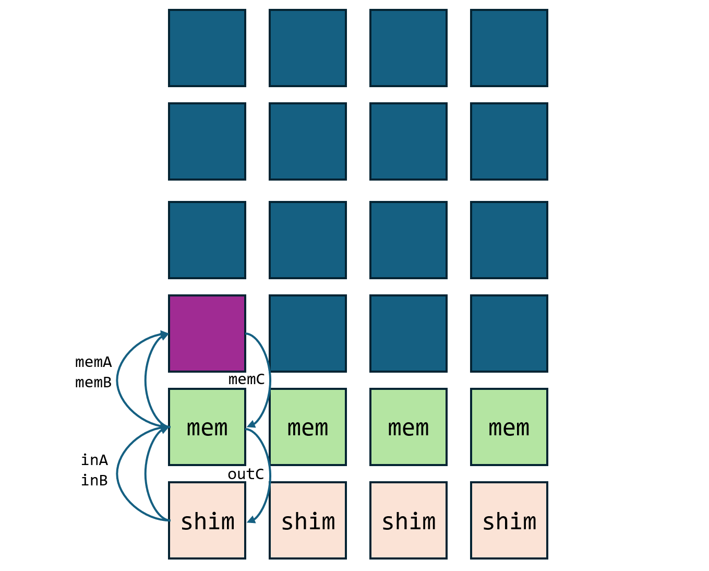
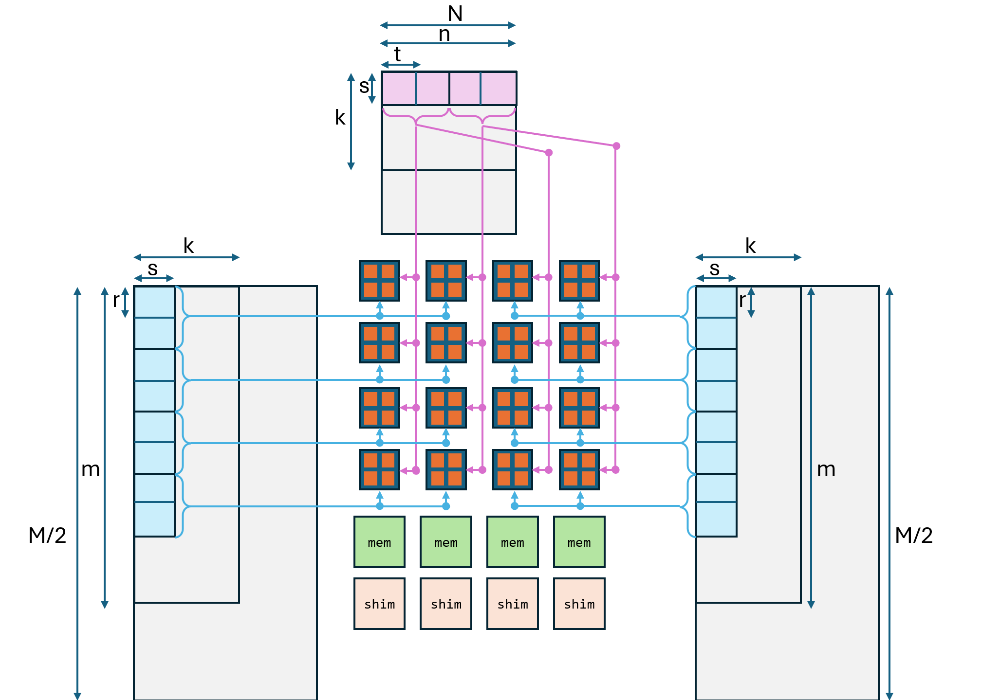

Project: AMD AI-Engine (AIE) Accelerator
=====================================

0) Setup
---------------

1. Login to `waiter.ucsd.edu` via RDP (Remote Desktop). Make sure you are in "UCSD Protected" network or connected to UCSD VPN.
2. Open the browser and go to `http://149.199.80.97:8002`
3. Type your username, select `mlir-aie` from the dropdown, and click `Start`.
4. Open a terminal, navigate to `mlir-aie/programming_examples/basic/matrix_multiplication/whole_array/` and run `make run` to run the example.

1) Introduction to AI Engine (AIE)
----------------------------------

AIE is a new kind of accelerator architecture developed by AMD that is distinct from CPUs, GPUs and FPGAs. It is designed to be a highly efficient and flexible architecture for accelerating a wide range of workloads. The AIE architecture is based on a dataflow model of computation, where data flows through a network of processing elements (PEs) that are connected by a network-on-chip (NoC). 

An AI Engine has 24 tiles arranged as 6 rows and 4 columns as shown. Each column has a shim tile, a memory tile and four compute tiles. Each of the 16 compute tiles has a local (L1) memory, a DMA and a VLIW processor optimized for large vector operations. 

There are three main components to programming an AI Engine:

1. **Host code (test.cpp):** This runs on the host CPU outside the AI Engine and is responsible for setting up the AI Engine, creating example data, transferring data & instructions to and from the AI Engine, and verifying the results.
2. **Dataflow description (aie.py):** This Python script describes the dataflow within the AI engine. This is acheived by configuring high level primitives such as object fifos, to move data between tiles of the AI Engine. This script also points to the kernel function that will be executed in the VLIW processors of each tile.
3. **Kernel functions (aie_kernels/aie2/mm.cc):** These are C++ functions that are compiled to run in the VLIW processors that make the compute tiles of the AI Engine.

`Quick Reference to architecture manual, programming guide, API & intrinsic documentation. <https://www.xilinx.com/htmldocs/xilinx2022_2/aiengine_programming_guide/aie_programming_guide.html>`_

2) Matrix Multiplication Tutorial
------------------------------------

Read and understand the following:

0. `Tutorial <https://github.com/Xilinx/mlir-aie/tree/main/programming_examples/basic/matrix_multiplication/whole_array>`_
1. `Host code <https://github.com/Xilinx/mlir-aie/blob/main/programming_examples/basic/matrix_multiplication/test.cpp>`_
2. `Dataflow code <https://github.com/Xilinx/mlir-aie/blob/main/programming_examples/basic/matrix_multiplication/whole_array/aie2.py>`_
3. `Kernel code <https://github.com/Xilinx/mlir-aie/blob/dfad2074779ce69db95f24cf7cf7a2a1fabf299d/aie_kernels/aie2/mm.cc#L42>`_

4) Further Explanation of Whole Array Matrix Multiplication
------------------------------------------------------------

The above image describes the whole array matrix multiplication design for the Ryzen AI device. Two submatrices of size `r` x `s` from matrix A are broacasted across the each row of the AIE tiles. Similarly, two submatrices of size `s` x `t` from matrix B are broadcasted across each column of the AIE tiles. The compute tiles perform the vector multiply-accumulate operations on the submatrices and store the results in the output matrix C. 

+---------------+---------------+---------------------+---------------------------+
| Matrix        | Size          | Submatrix Size (1.) | Vector Intrinsic Size (2.)|
+===============+===============+=====================+===========================+
| `A` (Input)   | `M` x `K`     | `m` x `k`           | `r` x `s`                 |
+---------------+---------------+---------------------+---------------------------+
| `B` (Input)   | `K` x `N`     | `k` x `n`           | `s` x `t`                 |
+---------------+---------------+---------------------+---------------------------+
| `C` (Output)  | `M` x `N`     | `m` x `n`           | `r` x `t`                 |
+---------------+---------------+---------------------+---------------------------+

**Multiple levels of tiling (M,K,N) -> (m,k,n) -> (r,s,t)**

We first specify the dimensions `M`, `K`, `N` for the input matrices `A` (`MxK`), and `B` (`KxN`), and the output matrix `C` (`MxN`), as well as their data type. To enable efficient computation, our design will split large input matrices into smaller sub-matrix blocks on two levels; we thus also define the sizes of those sub-matrices. 

At the first level, the constants `m`, `k`, and `n` define the size of the submatrices processed by each AIE core. This is done in the `dataflow code <https://github.com/Xilinx/mlir-aie/blob/main/programming_examples/basic/matrix_multiplication/whole_array/aie2.py>`_, especially in the `aie.runtime_sequence()` operation, which describes the host-to-memory-tile transfer.

At the second level, we further subdivide using smaller sizes `r`, `s` and `t` -- these are the sizes of required by the vector computation intrinsics of the AIEs. We leverage the multidimensional DMAs available in AIEs, through a higher level abstraction (object fifo), to automatically tile and load at this level. 

The two levels of tiling of the output matrix `C` (`MxN`) is shown below:

**Vector intrinsic size: (r,s,t)**

Each compute core of the AI Engine is a VLIW vector processor. That is, it can perform 512 int8, or 64 int16 multiply-accumulate operations in parallel, within one clock cycle. It also can perform two loads and one store of vectors in one clock cycle. Therefore, to maximize the performance, the kernel code uses `aie::load_v()` and `aie::store_v()` primitive functions to load entire vectors: a row from matrix A of size `r` and a column from matrix B of size `s`. We also use the `MMUL::mac()` primitive to perform the multiply-accumulate on a pair of vectors. We perform four such vector MACs at once to maximize performance. The APIs and primitives are listed `here <https://www.xilinx.com/htmldocs/xilinx2022_2/aiengine_api/aie_api/doc/modules.html>`_.

**Loading 2nd level tiles using object fifos**

The `memA_fifos` and `memB_fifos` receive sub-matrices of size `m` x `k` and `k` x `n`, respectively. The FIFOs translate those matrices from a row-major format (or, alternatively, column-major for `B` if `b_col_maj` is set) into the `r` x `s`-sized and `s` x `t`-sized blocks required by the hardware's vector instrinsics before sending them into the compute cores memory.

For matrix A (`memA_fifos`), this transformation is expressed using the following wraps and strides as a list of tuples `(wrap, stride)`, given as arguments to the `object_fifo()` operation:
(Note that `//` denotes integer floor-division in Python.)

    

* (m // r, r * k),   # Pair 1
* (k // s, s),       # Pair 2
* (r, k),            # Pair 3
* (s, 1),            # Pair 4

Let us break down each component of this pattern. We do so back-to-front for ease of understanding:

* Pair 4: `(s, 1)`
    * This dimension represents the transfer of a single row of a `r` x `s`-sized tile (our target tile size after the transformation).
    * Wrap: `s` is the length of a row of a `r` x `s`-sized block in units of 4 bytes (i32 elements).
    * Stride: A stride of `1` retrieves contiguous elements.
* Pair 3: `(r, k)`
    * Together with the previous dimension, this dimenison represents the transfer of a single `r` x `s`-sized tile.
    * Wrap: `r` is the number of rows of a `r` x `s`-sized tile.
    * Stride: `k` is the stride between first element of each consecutive row along the `m` dimension, i.e. adding this stride to a memory address points to the element in the matrix directly below the original address. 
* Pair 2: `(k // s, s)`
    * Together with the previous dimensions, this dimension represents the transfer of one row of `r` x `s`-sized tiles, i.e. the first `k` x `s` elements of the input array.
    * Wrap: `k // s` is the number of `r` x `s`-sized tiles along the `k` (columns) dimension.
    * Stride: `s` is the stride between starting elements of consecutive blocks along the `k` dimension, i.e. adding this stridde to a memory address points to the same element in the `r` x `s`-sized block directly to the right of the block of the original address.
* Pair 1: `(m // r, r * k)`
    * Together with the previous dimensions, this dimension transfers the entire `m` x `k`-sized matrix as blocks of `r` x `s`-sized tiles.
    * Wrap: `m // r` is the number of `r` x `s`-sized blocks along the `m` (rows) dimension.
    * Stride: `r * k` is the stride between starting elements of consecutive blocks along the `m` dimension, i.e. adding this stride to a memory address points to the same element in the `r` x `s`-sized block directly below the block of the original address.

The following image describes the pattern of the object fifos for matrix A:

5) Single Core Matrix Multiplication
-------------------------------------

This is a simplified version of the matrix multiplication example that uses only a single core of the AI Engine. The host code is the same. The kernel code is the naive matmul code in C++. This can be used to understand the concepts further.

0. `Single core Tutorial <https://github.com/Xilinx/mlir-aie/tree/main/programming_examples/basic/matrix_multiplication/single_core>`_
1. `Single core Host code <https://github.com/Xilinx/mlir-aie/blob/main/programming_examples/basic/matrix_multiplication/test.cpp>`_
2. `Single core Dataflow code <https://github.com/Xilinx/mlir-aie/blob/main/programming_examples/basic/matrix_multiplication/single_core/aie2.py>`_
3. `Single core Kernel code <https://github.com/Xilinx/mlir-aie/blob/dfad2074779ce69db95f24cf7cf7a2a1fabf299d/aie_kernels/aie2/mm.cc#L27>`_

The following image shows the dataflow for the single core matrix multiplication:

6) Questions
-------------

1. Explain the two levels of tiling used in the matrix multiplication design for the Ryzen AI device. Why are both levels of tiling necessary, and what advantages do they provide?

2. What role do ObjectFIFOs play in the design of the data movement within the AIE array? Describe how ObjectFIFOs facilitate synchronization between compute cores and memory tiles.

3. Discuss the purpose of "ping" and "pong" phases in data transfer. How does this design choice improve performance in handling large matrices?

4. Why are different tiling dimensions (r, s, t) chosen for vector intrinsic instructions? Explain how these values are related to the hardware requirements and how they enhance efficiency.

5. Change the parameters: (m, k, n, r, s, t) in the code, generate performance metrics and compile it into a chart, for int8, int16, int32 and float datatypes. Analyze your observations.

7) Project
-------------

The whole array design is efficient for matrices that are much bigger than the 4x4 AI Engine array. However, if the N dimension is small, it would be wasteful to pad the matrix with zeros. The following is a design that would be more efficient for small N dimensions:

Note that dimenison `N` of input matrix B and the output matrix C is smaller than the number of columns in the AI Engine array. Therefore, we can split the input matrix A into two matrices of size `M/2` x `K` We can then broadcast the two submatrices of A across the rows and the two submatrices of B across the different groups of columns of the AI Engine array as shown. 

Start with the whole array design as reference and implement this project. Present a comparison of performance metrics between this design and the whole array design with padded B matrix for different matrix sizes and datatypes. Analyze your observations.
