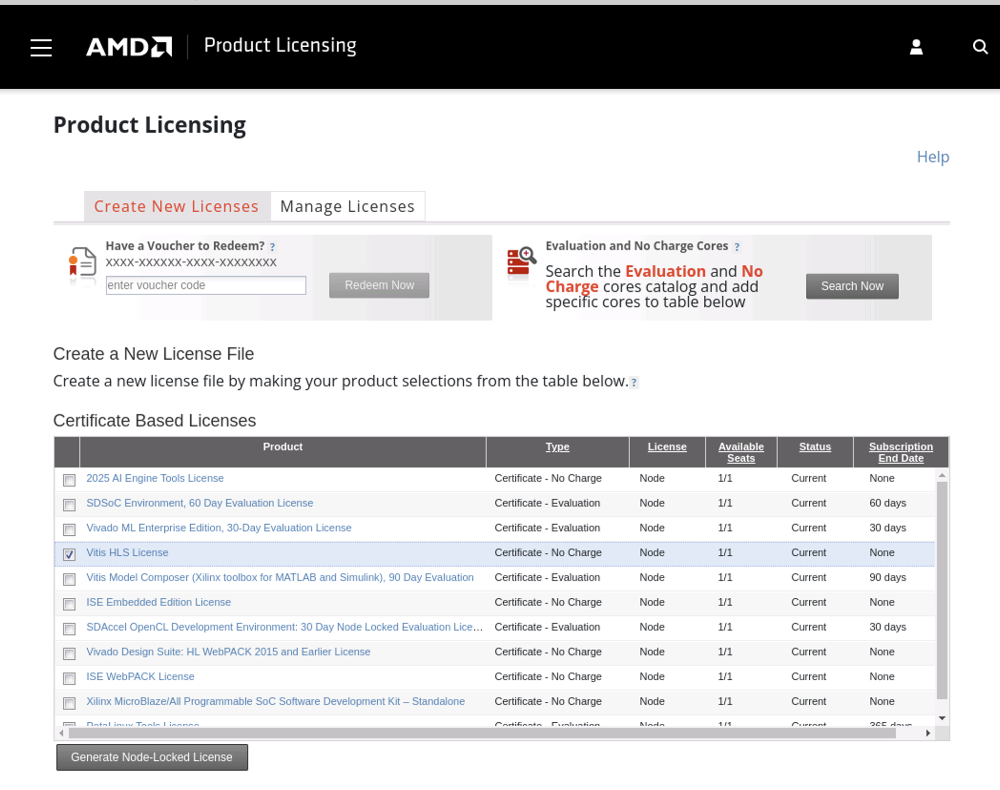
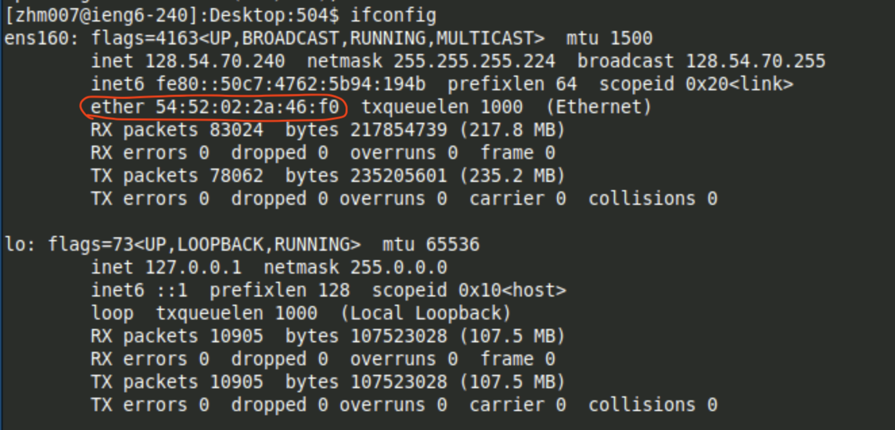
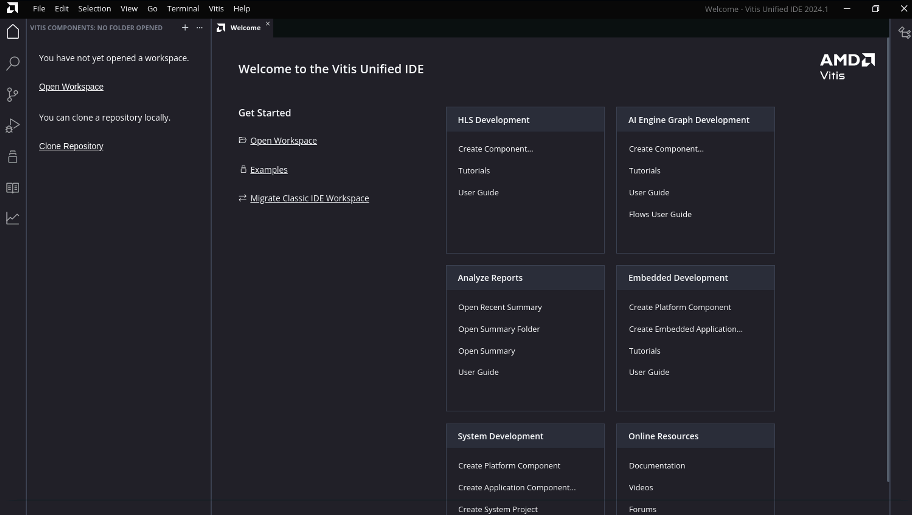
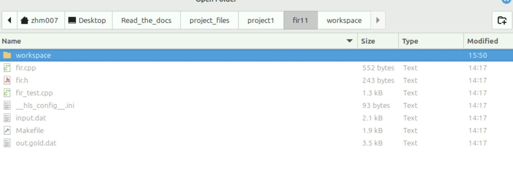
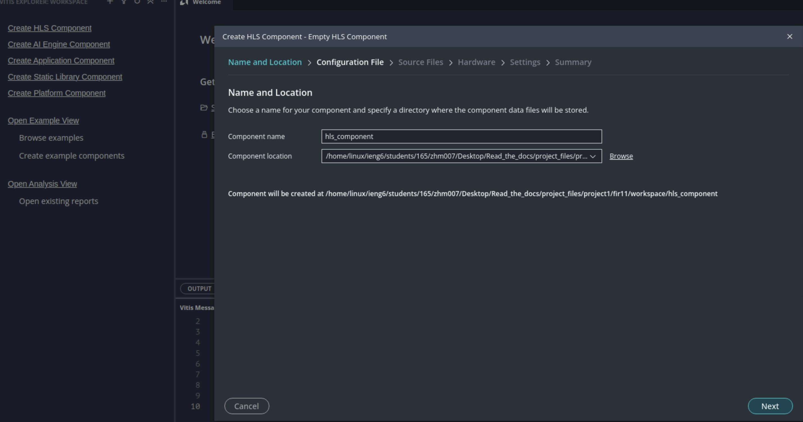
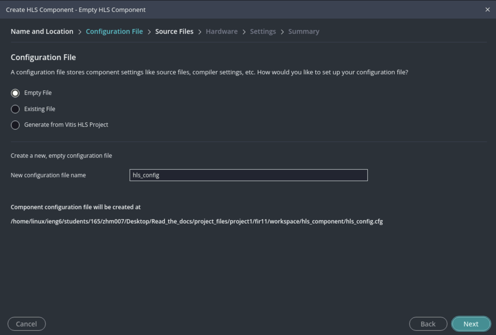
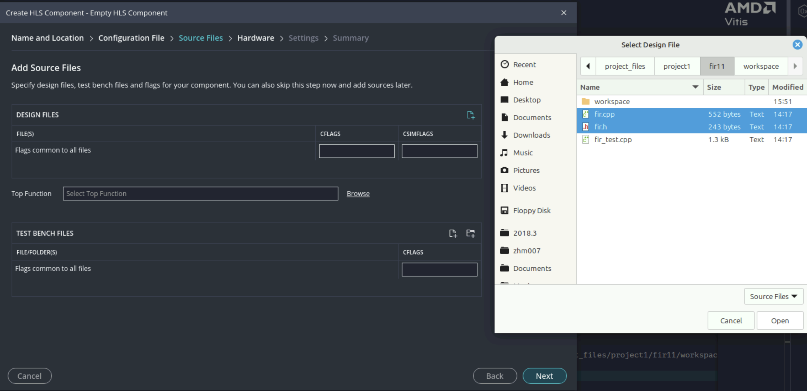
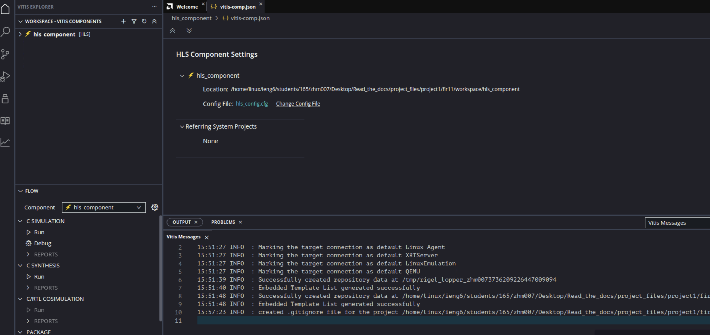
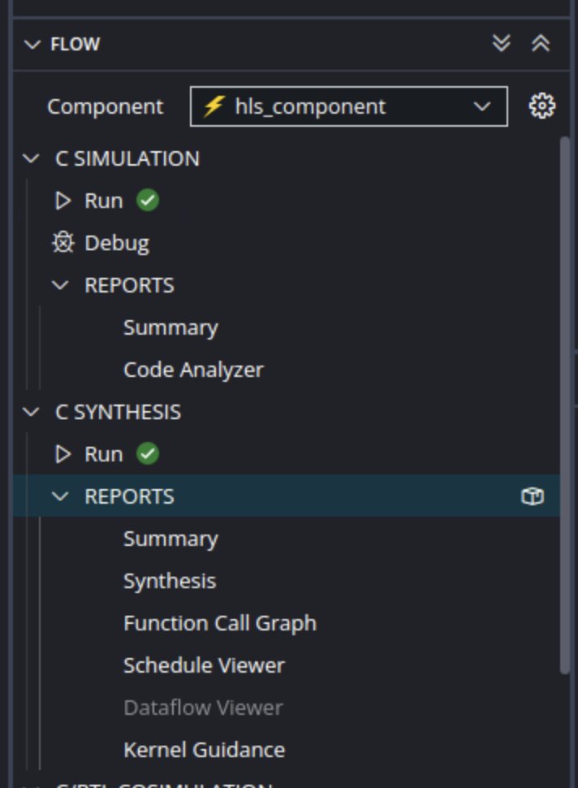

Using Vitis Unified IDE for HLS
================================

1) Introduction
---------------

Since 2024, AMD is promoting a new Unified IDE for HLS, firmware, and AI engine developments, and phasing out the classic Vitis HLS. The new Vitis IDE works very differently with past versions of Vitis and Vitis/Vivado HLS, featuring a vscode-like experience.

For the assignments, you do **not** have to use the GUI Vitis IDE. Submission is also CLI-based, and we must be able to re-create your results from your source code and Makefile. However, some people do prefer developing with the GUI interface. The visualization tools would also help you gain some insights about your design.

This section will walk you though a simple example of using Vitis Unified IDE for HLS. 

2) Installation and licensing
--------------------------------
No further installations are needed if you already have Vitis and Vivado 2024.2.

You do not need to acquire additional licenses for C simulation and C synthesis. However, if you wish to use some helpful visualization tools provided by Vitis IDE, you do need a free Vitis HLS license.

Check how can you obtain a free Vitis HLS license `here <https://docs.amd.com/r/en-US/ug1399-vitis-hls/Obtaining-a-Vitis-HLS-License>`_. You need to log in to you AMD account.

Select **Vitis HLS License** and click Generate Node-Locked License. Note that this license is only good for one machine. However you can change the machine it is tied to by modifying the license.

You will be asked to select a host. The ieng6 is Linux 64 bit. You have to use the ethernet MAC address as the identifier. Simply run ``ifconfig``:

You will get an email with the license file ``.lic`` attached. If you need to transfer it from your laptop to ieng6, you can simply use ``scp``.

	``scp /path/to/license username@ieng6.ucsd.edu:~/path/to/license``

Add this line to your **~/.bashrc** file so that Vitis is aware of the license:

   ``export XILINXD_LICENSE_FILE=2100@cselm2.ucsd.edu:~/path/to/license``

You can also convenientely log in to ieng6 using ssh.

Note that if you log off and log in to a different machine (e.g., log off from ``ieng6-240.ucsd.edu`` and log in to ``ieng6-241.ucsd.edu``), the ethernet address will be different and the license may not work. You need to log in to Xilinx licensing manager and modify the existing license. It's recommended for each group to use a dedicated remote desktop.

Your home directory is persistent and is shared by all ieng6 machines.

Using advanced GUI features in Vitis HLS is optional. You can still complete the lab without a license.

3) Codebase & structure
-------------------------

We will use project 1: FIR 11 as the codebase. It's recommended to complete the command line version of C synthesis first before trying out the GUI version.

After running ``make report``, you already have a component folder with all the project files. However, it's non-trivial to open the component with full functionality in Vitis IDE. The easiest way is to create a new workspace and components from the source code.

Let's review the contents of the project fir11 folder:

* fir11 folder: 

  - fir.cpp - Implements top-level function. Required as a source file.

  - fir.h - header file. Required as a source file.

  - fir_test.cpp - test bench. Required as a tb file.

  - input.dat - input chirp signal. Required as a tb file.

  - out.gold.dat - “Golden” output. Required as a tb file.

  - __hls_config__.ini - Not needed for Vitis IDE.

  - Makefile - Not needed for Vitis IDE.

  - .tcl, .rpt, and components generated by CLI - Not needed for Vitis IDE.

4) Steps
---------

At welcome page, select **Open workspace** and create a new workspace folder. One convinient option would be just to creat a folder local to your fir11 source files.

Next, select **Create HLS Component** from the left panel, and follow the set-up wizard.

Add the source files, the top function should be detected automatically.

.. image:: ./image/lab1/top.png

Set the board type, target clock cycle, clock uncretainty, and other options.

.. image:: ./image/lab1/hardware.png

Now, you can see the opntions at the bottom-left corner, including C simulation, C synthesis, Co-simulation and IP Packaging.

Simply click on the button to run simulation & synthesis. 

There are some advanced GUI features that you can explore, such as code analysis and function call graph. This could give you a better understanding of the code structure and performance (e.g., how well are they pipelined).

